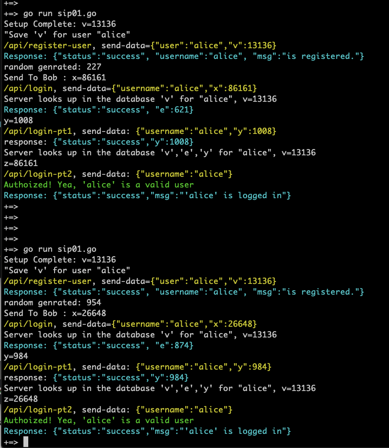

m4_include(../../../setup.m4)

Lecture 24 - Zero Knowledge Identification System
=====================================

## Reading

Paper:
[https://arrow.dit.ie/cgi/viewcontent.cgi?article=1031&context=itbj](https://arrow.dit.ie/cgi/viewcontent.cgi?article=1031&context=itbj)

Look at page 38, section 7.9. to 7.12 on page 43 (this is the page numbers in
the PDF - it is the 28th page OF the PDF).

Walk through of algorithm with the example from the paper.

Also see:
[https://blog.cryptographyengineering.com/2017/01/21/zero-knowledge-proofs-an-illustrated-primer-part-2/](https://blog.cryptographyengineering.com/2017/01/21/zero-knowledge-proofs-an-illustrated-primer-part-2/)

Also: the reading from last time - has a nice section on this method for
identification of users.

First a tiny detour - how to authenticate a QR or RFID tag.
-------------------------------------------------------------

QR codes encode some sort of text. Some RFID tags encode just a number. Others
like NFC encode a chunk of text between 84 and 1084 characters long. Usually
these chunks of text are URLs to some website or set of information. People
would like to use the tags as proof-of-authenticity. The problem is how to get
them to be secure. NFC tags can have computation built int - but it is really a
small amount - the power for the NFC is coming from radio waves being
transmitted from the source. So you take you Android and its tiny transmitter
and send the NFC tag a tiny bit of power - that then looses lots of power
because it has to be picked up by a tiny antenna in the "chip" and then used to
do a small, small amount of computation and then using that same power send back
an answer. So building any kind of "authentication" that is meaningful into the
chip is difficult. A QR code is a static image - so it will not do any
computation at all.

So if you can't do the authentication on the chip or device. What about just
adding Two Factor Authentication after the device is scanned. Basically have the
QR or RFID send you to a page where you have to authenticate using a device
(iPhone, Android) and provide proof of your authenticity at that point.


Zero knowledge proof for use as ID
----------------------------------

```
m4_include(sip01.go.nu)
```

Reunsts of 2 runs:



